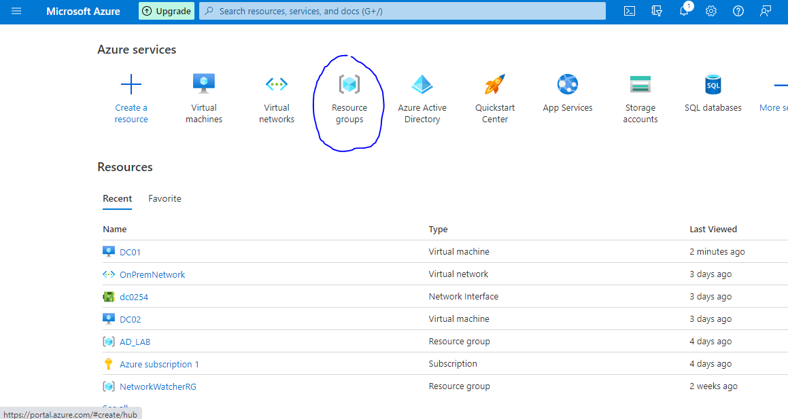

<h2>Using Microsoft Azure to host Windows Active Directory lab</h2>
<h2>Overview</h2>

This is a walkthrough on how to set up an Active Directory lab within the Microsoft Azure cloud service. This Active Directory scenario will contain two domain controllers on the same domain to simulate a real life scenario. I recommend this to anyone who may want to have an Active Directory home lab to further their skills but their home PC cannot handle the virtualization. This is a perfect solution because it will all be hosted on the cloud, meaning that your home PC will only be running HTTPS and RDP to access this lab. Once you have completed this lab I also recommend doing more research on Active Directory and working on your lab to simulate what it may be like in a real world setting. Some examples may be: create and delete user accounts, Resetting passwords, set permissions, organize your company’s network hierarchy, Finding policies in Domain group policies, DNS, DHCP, Domain Controller and many many more. 
<h2>Prerequisites </h2>

-Microsft Azure 
-Windows Remote Desktop Connection 
<h2>Steps</h2>

<b>-1.)Create Resource group</b>

-Once logged in, redirect to the Home portal for Microsoft Azure. Under 'Azure services' select 'Resources Groups'. Select 'Create a resource' 

 
	-Name Resource Group 'ADLAB' 
  

<b>-2.)Virtual Network</b>

&emsp;	<b>Under Basics Tab </b>
	-Name the Virtual Network "OnSite" 
  &emsp;	<b>IP Addresses Tab </b>
	-Click on the blue highlighted 'default' under the Subnet name 
  -Change Subnet Address range to '10.0.1.0/24 
    &emsp;	<b>Security Tab </b>
	-Under Security make sure all tabs are Disabled  
  -You can skip the 'Tags' tab
	-Review & Create 
	-Allow the Virtual Network to deploy  
  

<b>-3.)Create Virtual Machines within Resource groups</b>

-Redirect to the Home portal for Microsoft Azure. Under 'Azure services' select 'Virtual Machines' then select Create  
	&emsp;	<b>Under Basics Tab </b>
	-Add to Resource Group that was previously created 'ADLAB' 
	-Name the virtual machine 'DC1' 
	-Change Availability option to Availability set and Create an availability set 
		-Name 'ADAvailSet' and leave as defaults  
	-Use a Windows Server 2019 Database serve image  
		-2vcpus 8Gbs memory works great 
	- Create username and password  
		&emsp;<b>Under Disks Tab </b>
	-Change OS Disk type to Standard HDD 
	-Select 'Create and Attach a disk' 
		-Select 'Change Disk Size' 
		-Change the 'Disk SKU' to Standard HDD 
		-Change disk size to 10Gb (This is where active directory will be installed) 
		&emsp;<b>Under Networking Tab </b>
	-Nothing needs to be changed just double check that the virtual network is the "OnSite" network 
	-Also double check that RDP 3389 is open to access your virtual machine 
&emsp;	<b>	Under the Management tab </b>
	-Disable boot diagnostics  
	 -Select Review & Create 
	-Allow the virtual machine to deploy 
  

<b>-4.) Configuring Virtual Machine 1</b>

	&emsp;	<b>Within 'DC1' </b>
	-Select 'Connect' > 'RDP' and download the RDP client file then login (I recommend selecting all of the 'remember me', 'don't ask again' boxes) 
	-Allow the VM to boot to desktop and wait to server manager to boot  
	&emsp;	<b>Format F: Disk drives to contain Active Directory </b>
	-Within the server manager select 'Tools' on the top right > 'Computer Management'  
	-Once open select 'Disk Management'   
		-Leave disk as an MBR (Master Boot Record) click OK 
		-Right Click the Disk 2 and select 'New Simple Volume' 
		-Leave the disk as F: and select next until done 
	&emsp;	<b>Install  and deploy Domain Controller on Virtual Machines </b>
	-Click 'Manage' > 'Add roles and features'  
	-Select Next until on the Server Installation tab 
	-Check the Active Directory Domain Services and select Add Features 
	-Select Next until on the Confirm installation selections and finally select install  
	-Once completed Select the 'Promote this server to domain controller' (if you accidentally closed this tab select the flag with the yellow warning sign on the top right next to the 'Management' tab and you will have this option here) 
	-Select 'Add new forest' and name the domain "myazurelab.com" 
	-Select Next and make sure its Windows Server 2016 and create a password and select Next 
	-Skip the DNS creation and skip Additional Options 
	-Under Paths tab change the disks from the C: drive to the F: drive 
	-Select Next and Install (this will install the active directory domain controller) 
	-Once complete you will be signed out and have to restart the VM and reconnect with RDP 
  

<b>-5.)Creating second Domain Controller VM</b>

	&emsp;<b>	Within Resource group </b>
  -Select the Virtual Machines tab, then select Create 
&emsp;	<b>	Under Basics Tab </b>
	-Add to Resource Group 
	-Name 'DC2' 
	-Change Availability option to Availability set 'ADAvailSet' 
	-Use a Windows Server 2019 Database serve image  
		-2vcpus 8Gbs memory works great 
	- Create username and password  
&emsp;	<b>	Under Disks Tab </b>
	-Change OS Disk type to Standard HDD 
	-Select 'Create and Attach a disk' 
		-Select 'Change Disk Size' 
		-Change the 'Disk SKU' to Standard HDD 
		-Change disk size to 10Gb (This is where active directory will be installed) 
&emsp;	<b>	Under Networking Tab </b>
	-Nothing needs to be changed just double check that the virtual network is the "OnSite" network 
	-Also double check that RDP 3389 is open to access your virtual machine 
&emsp;	<b>	Under the Management tab </b>
	-Disable boot diagnostics  
	-Select Review & Create 
	-Allow the virtual machine to deploy 
  

<b>-6.)Configuring DNS from Domain Controller instead of Azure dynamic IP and DNS (DC1)</b>

	&emsp;	<b>Within 'DC1' VM </b>
	-Redirect to the 'DC1' Virtual Machine on Azure 
	-Within the 'Overview' tab under the 'Properties' tab  > 'Networking' copy the IP address  
	-Within the settings tab, select the 'Networking' tab , select the highlighted 'Networking interface' 
	-Within the Networking interface settings tab select the 'IP configurations' tab 
	-Select the current IP > Change the 'Dynamic' setting to 'Static'  
	&emsp;	<b>Within 'OnSite' Virtual Network </b>
	-Redirect to the 'OnSite' Virtual Network  
	-Within the settings tab, select the 'DNS servers' tab and then select Custom  
	-Paste the DC1's IP address and Save 
	-Redirect to Virtual Machines and restart both DC1 and DC2 to update the DNS 
  

<b>-7.) Adding Domain Controller to second VM</b>

	&emsp;<b>	Within 'DC2' </b>
	-Select 'Connect' > 'RDP' and download the RDP client file then login (I recommend selecting all of the 'remember me', 'don't ask again' boxes) 
	-Allow the VM to boot to desktop and wait to server manager to boot  
		&emsp;<b>Format F: Disk drives to contain Active Directory </b>
	-Within the server manager select 'Tools' on the top right > 'Computer Management'  
	-Once open select 'Disk Management'   
		-Leave disk as an MBR (Master Boot Record) click OK 
		-Right Click the Disk 2 and select 'New Simple Volume' 
		-Leave the disk as F: and select next until done 
		&emsp;<b>Adding 'DC2' to the domain </b>
	-Within the Server Manager select the 'Local Server' tab > 'Workgroups' and click the blue highlighted 'WORKGROUP'  
	-Within the System Properties > Computer Name tab, select the 'Change..." box 
	-Within Computer Name/Domain Changes, under Members of, select the Domain check box and type 'myazurelab.com' 
	-Use the credentials of 'DC1' to authorize this new addition  
	-Allow the Domain Controller to add this VM and restart the VM  
		&emsp;<b>Install  and deploy Domain Controller on Virtual Machine 2 </b>
	-Click 'Manage' > 'Add roles and features'  
	-Select Next until on the Server Installation tab 
	-Check the Active Directory Domain Services and select Add Features 
	-Select Next until on the Confirm installation selections and finally select install  
	-Once completed Select the 'Promote this server to domain controller' (if you accidentally closed this tab select the flag with the yellow warning sign on the top right next to the 'Management' tab and you will have this option here) 
	-Select 'Add a domain controller to an existing domain' 
	-Type 'myazurelab.com' into the domain 
	-Select the 'Change...' box to add credentials  
	-Type myazurelab\DC1 for the username and type the password you created then select next  
	-Create a password and select next 
	-Skip the DNS creation  
	-Under Additional Options tab, change the 'Replicate from' to DC1.myazurelab.com 
	-Under Paths tab change the disks from the C: drive to the F: drive 
	-Select Next and Install (this will install the active directory domain controller) 
	-Once complete you will be signed out and have to restart the VM and reconnect with RDP 
  

<b>-8.)Configuring DNS from Domain Controller instead of Azure dynamic IP and DNS (DC2)</b>

	&emsp;<b>	Within 'DC2' VM </b>
	-Redirect to the 'DC2' Virtual Machine on Azure 
	-Within the 'Overview' tab under the 'Properties' tab  > 'Networking' copy the IP address (Similar to step 6)  
	-Within the settings tab, select the 'Networking' tab , select the highlighted 'Networking interface' 
	-Within the Networking interface settings tab select the 'IP configurations' tab 
	-Select the current IP > Change the 'Dynamic' setting to 'Static'  
&emsp;	<b>	Within 'OnSite' Virtual Network </b>
	-Redirect to the 'OnSite' Virtual Network  
	-Within the settings tab, select the 'DNS servers' tab and then select Custom  
	-Paste the DC2's IP address as the second IP and Save 
	-Redirect to Virtual Machines and restart both DC1 and DC2 to update the DNS 
		&emsp;<b>Within DC1 </b>
	-RDP into DC1 and let everything boot up 
	-Within Server Manager select Tools > Active Directory Sites and Services, and rename 'Default-First-Site-Name' to 'OnSite' 
  

<b>-9.)Configuring Subnets on Virtual Network</b>

	&emsp;	<b>Within 'OnSite' virtual network </b>
	-Within settings, select Subnets 
	-Copy the IPv4 subnets 
	&emsp;	<b>Within DC1 </b>
	-Within Server Manager select Tools > Active Directory Sites and Services 
	-Right click the Subnets OU, then select 'New Subnet' 
	-Paste the IPv4 subnets from 'OnSite' into the prefix box and select the 'OnSite' Site Name then select OK 
  

<b>-10.) Confirming the dual domain controllers are working</b>

	&emsp;<b>	Within DC1 </b>
	-Within Server Manager select Tools > Active Directory Users and Computers  
	-Right click the Users OU select New > User 
	-Create a new user with the name 'Test1' and then create a password for the user, select OK and Finish 
	-Right click on 'myazurelab.com' > select Change Domain Controller  
	-Select the DC2 'DC2.myazurelab.com' then select OK 
	-Open the Users OU and find the Test1 user to confirm that the domain controllers are connected 
<b>Congratulations you now have an active directory lab on Azure!</b>
